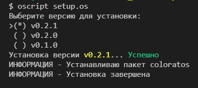

# Цветной вывод

## Библиотека `coloratos` для OneScript для цветного вывода в консоль

> coloratos - игра слов color-text-oscript

----------------------------------------------------

## Шаблон вывода

Вывод формируется по шаблону `(Текст|#color=Цвет)`, где  
- `Текст` - произвольный текст  
- `Цвет` - строковое значение перечисления `ЦветКонсоли.*`

----------------------------------------------------

## Установка

- из хаба пакетов `opm i coloratos`
- из локального файла *.ospx: `opm i -f coloratos.ospx`
- с помощью установщика:
  -  `oscript setup.os VERSION`, где VERSION - номер релиза (см. https://github.com/240596448/coloratos/releases)
  - `oscript setup.os latest` - установка последней версии
  - `oscript setup.os` - интерактивный выбор версии  
    > Например:  
    

----------------------------------------------------


## Примеры использования:

```bsl
#Использовать ".."

ЦветнойВывод.Вывести("Процесс выполнения... ", "Серый");
ЦветнойВывод.ВывестиСтроку("Done", "Зеленый");
``` 
> Результат:  


```bsl
#Использовать ".."
ЦветнойВывод.ВывестиСтроку(
		"(Оу!|#color=White) Привет, (Красный!|#color=Красный) Кажется я выгляжу '(малиновым|#color=Малиновый)'.
		|Ты тоже видишь (желтый текст|#color=Желтый) ???", "Синий");
```
> Результат:  


***Особенности*** 
- не поддерживаются переносы текста выделяемой подстроки, многоуровневая вложенность шаблона `(Текст|#color=Цвет)`
- не поддерживается установка ЦветаФона
-------------------------------------------------
[-->](test/test.os) Больше примеров в [test/test.os](test/test.os)
