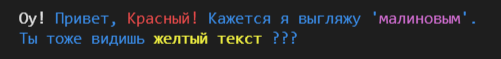

# Цветной вывод

## Библиотека `coloratos` для OneScript для цветного вывода в консоль

> coloratos - игра слов color-text-oscript

----------------------------------------------------

## Шаблон вывода

Вывод формируется по шаблону `(Текст|#color=Цвет)`, где  
- `Текст` - произвольный текст  
- `Цвет` - строковое значение перечисления `ЦветКонсоли.*`

----------------------------------------------------

## Установка

- из локального файла *.ospx: `opm i -f coloratos.ospx`
- по прямому url: `opm i --url https://github.com/240596448/coloratos/releases/download/v{TAG}/coloratos-{TAG}.ospx`, где {TAG} - номер релиза
- из репозитория `oscript setup.os {TAG}`, где {TAG} - номер релиза вида X.X.X (см. https://github.com/240596448/coloratos/releases)

----------------------------------------------------


## Примеры использования:

```bsl
#Использовать ".."

ЦветнойВывод.Вывести("Процесс выполнения... ", "Серый");
ЦветнойВывод.ВывестиСтроку("Done", "Зеленый");
``` 
> Результат:  


```bsl
#Использовать ".."
ЦветнойВывод.ВывестиСтроку(
		"(Оу!|#color=White) Привет, (Красный!|#color=Красный) Кажется я выгляжу '(малиновым|#color=Малиновый)'.
		|Ты тоже видишь (желтый текст|#color=Желтый) ???", "Синий");
```
> Результат:  


-------------------------------------------------
Больше примеров см. в [test/test.os](test/test.os)
